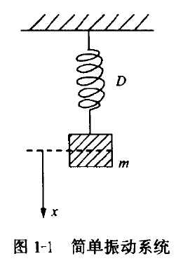
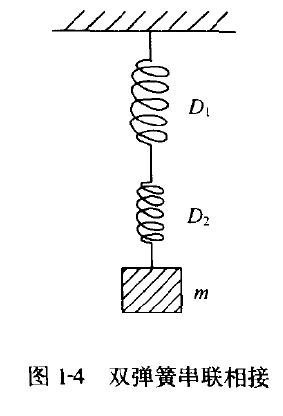
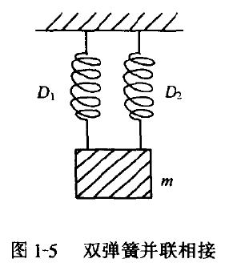

## Formulation-derivation

根据胡克定律有
$$
f=-Dx
$$
此处，$x$是质量$m$离开平衡位置的位移，$D$是弹簧弹性系数。$f$表示弹力，与质量位移方向相反，根据牛顿第二定律有：
$$
f=m\dfrac{d^2x}{dt^2}
$$
因此可以得到：
$$
m\dfrac{d^2x}{dt^2}+Dx=0\\
\dfrac{d^2x}{dt^2}+\dfrac{D}{m}x=0
$$
定义常数$\omega_0=\sqrt{\dfrac{D}{m}}$,成为振动的角频率，故可以得到质点的自由振动方程。
$$
\dfrac{d^2x}{dt^2}+\omega_0^2x=0
$$
该方程的解为
$$
x=A_1cos\omega_0t+A_2sin\omega_0t
$$

也可以将(6)进行改写
$$
x=Acos(\omega_0t-\varphi_0)\\
A=\sqrt{A_1^2+A_2^2}\\
\varphi_0=arctan\dfrac{A_2}{A_1}\\
A_1=Acos\varphi_0\\
A_2=Asin\varphi_0\
$$
考虑方程的初始条件，初始位移$x|_{t=0}=x_0$，初始速度$v|_{t=0}=v_0$

可以得到
$$
A=\sqrt{x_0^2+(\frac{v_0}{\omega_0})^2}\\
\varphi_0=arctan(\frac{v_0}{\omega_0x_0})
$$

### 1-1-3 振动的能量

可将其分为系统位能(势能)$E_p$和动能$E_k$
$$
E_p=\int_0^xDxdx=\dfrac{1}{2}Dx^2
$$
质点m的动能可以表示
$$
E_k=\frac{1}{2}mv^2
$$
那么，系统的整体能量可以表示为
$$
\begin{eqnarray}
E & = &\frac{1}{2}Dx^2+\frac{1}{2}mv^2 \\
&=&\frac{1}{2}DA^2cos^2(\omega_0t-\varphi_0)+\frac{1}{2}m\omega_0A^2sin^2(\omega_0t-\varphi_0)\\
\because \omega_0 & =&\sqrt{\frac{D}{m}}\\
so&&E=\frac{1}{2}DA^2=\frac{1}{2}nv_{max}^2=\frac{1}{2}m\omega_0^2A^2
\end{eqnarray}\\
$$

### 1-1-5 弹簧串联与并联系统的振动

如图1-1，单振子系统中，假设弹簧D在重力mg作用下产生了静态位移$\xi$，从而弹簧对质量产生了弹力$-D\xi$

即

$$
mg-D\xi=0\\
then,D=\frac{mg}{\xi}
$$

$$
\because,2\pi f_0=\sqrt\frac{D}{m}\\
then,f_0=\frac{1}{2\pi}\sqrt\frac{g}{\xi}
$$

#### 考虑双弹簧串联相接与并联相接的两种振动

##### 串联相接

根据受力分析可以知道
$$
mg=D_2\xi_2=D_1\xi_1
$$
同时，有总的伸长量 $xi$
$$
\xi=\xi_1+\xi_2
$$
则有
$$
\xi_2=\dfrac{mg}{D_2}\\
\xi_1=\dfrac{mg}{D_1}\\
then\\
\xi=mg\dfrac{D_1+D_2}{D_1D_2}
$$
于是，可以求得系统的固有频率
$$
mg=D\xi\\
D=\dfrac{D_1D_2}{D_1+D_2}
$$
因此可以求得固有频率为
$$
f_0=\dfrac{1}{2\pi}\sqrt{\frac{g}{\xi}}=\dfrac{1}{2\pi}\sqrt \frac{1}{m\frac{D_1+D_2}{D_1D_2}}=\dfrac{1}{2\pi}\sqrt \frac{\frac{D_1+D_2}{D_1D_2}}{m}
$$

##### 并联相接

并联时候
$$
mg=D_1\xi+D_2\xi
$$

$$
f_0=\dfrac{1}{2\pi}\sqrt{\dfrac{g}{\xi}}=\dfrac{1}{2\pi}\sqrt{\dfrac{g}{\frac{mg}{D_1+D_2}}}=\dfrac{1}{2\pi}\sqrt{\dfrac{D_1+D_2}{m}}
$$

显然，串联式将使得系统频率降低，反之，并联式则是提高系统频率。